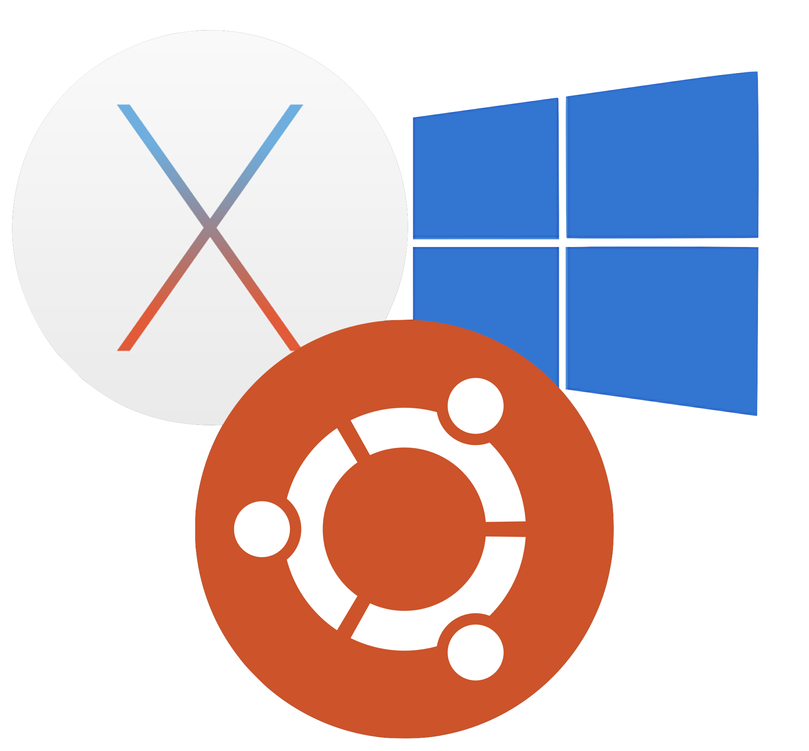

# DOM - Dotfile Organisation Manager
## The Dankest Dotfiles

Many of us have tapped into the chaotic good energy created from custom preferences, However keeping these bad bois consistent and shared between your work setups, virtual machines, raspberry pi, macbook, clusters, whatever Docker is, and the computer that you let your cat borrow in exchange for him doing the washing up, is not only challenging but damn frustrating when you can't rely on your beautiful alias's to do their job. 

So here collected, is a ubuntu/mac advanced developer setup for maintaining such a setup.

Your system crashes ---> a tear starts to trickle down your face as dark thoughts of setting up your system again enter your brain. A mental tally of the number of times you are going to have to write apt install begins to only be reminded every single time you do it that you forgot to write sudo. 

Swipe that misery away, reinstall from here and you will be frolicking with unicorns again.                                                                                           
# Description and Features

- Installation organised by application/OS
- anything titled "install.sh" will be run on start up
- Configures with Windows (Powerline still experimental but full WSL support), MacOS and Ubuntu

- **bin/**: Anything in `bin/` will get added to your `$PATH` and be made
  available everywhere.

- **topic/\*.bzsh**: Any files ending in `.bzsh` get loaded into your
  environment.
- **topic/path.bzsh**: Any file named `path.bzsh` is loaded first and is
  expected to setup `$PATH` or similar.
- **topic/completion.bzsh**: Any file named `completion.bzsh` is loaded
  last and is expected to setup autocomplete.

- **topic/install.sh**: Any file named `install.sh` is executed when you run `script/install`. To avoid being loaded automatically, its extension is `.sh`, not `.zsh`.
- **topic/\*.symlink**: Any file ending in `*.symlink` gets symlinked into
  your `$HOME`. This is so you can keep all of those versioned in your dotfiles
  but still keep those autoloaded files in your home directory. These get
  symlinked in when you run `script/bootstrap`.


# Plugins installed

## ZSH

## Alias finder

## Syntax highlighting 

## 
# Dotfile setup

```
sudo apt-get install git # if needed
git clone https://github.com/Ollivanders/dotfiles.git
./letsgo
```

If you have any troubles, read through: [a relative link][./troubleshooting.md]
